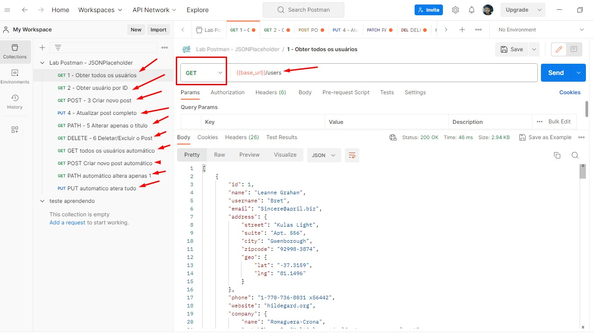

# 📡 Estudo de APIs REST com Postman

Projeto prático desenvolvido para aprender e testar requisições HTTP em uma API pública, aplicando boas práticas de organização e validação de respostas.

---

## 🛠️ Ferramentas utilizadas
- **Postman**: Criação, envio e validação de requisições
- **JSONPlaceholder**: API pública gratuita e confiável para simulação de dados
- **GitHub**: Versionamento e compartilhamento do projeto

---

## ✅ Métodos HTTP implementados
| Método | Finalidade |
|---|---|
| `GET` | Consultar e listar dados |
| `POST` | Criar novo registro |
| `PUT` | Atualizar todos os campos de um item |
| `PATCH` | Alterar apenas campos específicos |
| `DELETE` | Remover registro |

---

## 📸 Exemplos de execução

### 1. Requisição GET com testes automáticos
URL: `{{base_url}}/users`
Status esperado: `200 OK`

---

### 2. Requisição POST - Criar novo registro
URL: `{{base_url}}/posts`
Status esperado: `201 Created`

---

### 3. Requisição PUT - Atualização completa
URL: `{{base_url}}/posts/1`
Status esperado: `200 OK`

---

### 4. Requisição PATCH - Alteração parcial
URL: `{{base_url}}/posts/1`
Status esperado: `200 OK`

---

### 5. Requisição DELETE - Excluir registro
URL: `{{base_url}}/posts/1`
Status esperado: `200 OK`

---

## 🚀 Boas práticas aplicadas
✅ Uso de variáveis de ambiente para manter a URL organizada
✅ Testes automáticos para validar status e conteúdo da resposta
✅ Estrutura clara e fácil de entender

---

## 📁 Arquivos do projeto
- `Lab Postman - JSONPlaceholder.postman_collection.json`: Coleção completa, pronta para importar no Postman
- Pasta `imagens`: Capturas de tela das requisições funcionando

---

## 📥 Como usar
1. Baixe o arquivo `.json` da coleção
2. Abra o Postman → clique em **Import**
3. Selecione o arquivo → todas as requisições e testes já estarão configurados
